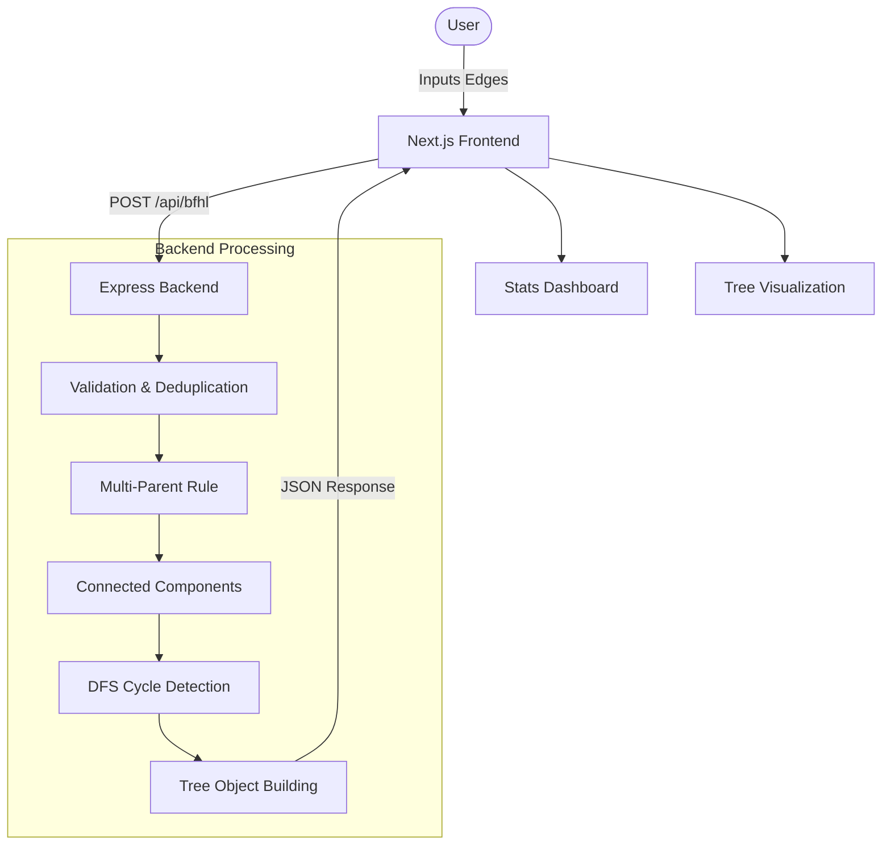

# 🪐 Bajaj Graph Engine (BFHL)

> **The ultimate engine for directed graph analysis. Detect cycles, build deep hierarchies, and classify edges with brutal efficiency.**

[](https://nextjs.org/)
[](https://www.typescriptlang.org/)
[](https://expressjs.com/)
[](https://nodejs.org/)

---

## 📖 Overview

The **Bajaj Graph Engine** is a high-performance, full-stack application built for the SRM Engineering Challenge. It solves the complex problem of parsing a stream of directed edges (e.g., `A->B`) and transforming them into a structured, hierarchical representation.

The system isn't just a simple parser; it features an advanced **Graph Engine** that handles edge validation, multi-parent resolution (first-parent wins), connected component discovery, and cycle detection using DFS coloring.

---

## ✨ Key Features

### 🛠️ Backend Intelligence
- **Strict Edge Validation**: Rejects malformed strings, self-loops, and multi-character nodes.
- **Tree Enforcer**: Implements a "First-Parent Wins" rule to ensure a strict tree structure from a graph input.
- **Cycle Detection**: Uses a 3-color DFS algorithm to identify and flag circular dependencies.
- **Hierarchy Mapping**: Calculates tree depth and generates nested JSON objects for visualization.
- **Statistics Engine**: Provides summaries on valid trees, largest depths, and duplicate counts.

### 🎨 Frontend Experience
- **Neobrutalist Design**: A high-contrast, premium UI that feels both modern and industrial.
- **Terminal Input**: A command-line inspired interface for data entry.
- **Real-time Analytics**: Visual dashboards for edge classification and tree statistics.
- **Interactive Hierarchies**: Dynamic rendering of tree structures derived from backend analysis.

---

## 🏗️ Architecture



---

## 🛠️ Tech Stack

- **Frontend**: [Next.js](https://nextjs.org/) (App Router), [React](https://reactjs.org/), [Vanilla CSS](https://developer.mozilla.org/en-US/docs/Web/CSS) (Custom Design System).
- **Backend**: [Node.js](https://nodejs.org/), [Express](https://expressjs.com/), [TypeScript](https://www.typescriptlang.org/).
- **Tools**: [Lucide React](https://lucide.dev/) (Icons), [Mermaid.js](https://mermaid.js.org/) (Diagrams).

---

## 🚀 Getting Started

### 1. Backend Setup
```bash
cd backend
npm install
npm run dev
```
*Server runs on `http://localhost:5000`*

### 2. Frontend Setup
```bash
cd frontend
npm install
npm run dev
```
*Application runs on `http://localhost:3000`*

---

## 🔌 API Reference

### POST `/api/bfhl`
Processes an array of nodes and edges.

**Request Body:**
```json
{
  "nodes": ["A->B", "B->C", "C->A", "D->E", "invalid"]
}
```

**Response Example:**
```json
{
  "is_success": true,
  "user_id": "prathmesh_24102005",
  "email": "pp9136@srmist.edu.in",
  "roll_number": "RA2311028010150",
  "valid_edges": ["A->B", "B->C", "D->E"],
  "invalid_entries": ["C->A", "invalid"],
  "hierarchies": [
    {
      "root": "A",
      "has_cycle": false,
      "tree": { "A": ["B"], "B": ["C"] },
      "depth": 3
    }
  ]
}
```

---

## 👨‍💻 Identity
**Developer**: Prathmesh  
**Roll Number**: RA2311003010873  
**Email**: [pp9136@srmist.edu.in](mailto:pp9136@srmist.edu.in)

---

<div align="center">
  <p>Built with ❤️ for the Bajaj Finserv Health Limited Challenge</p>
</div>
